<div>
  
</div>

<div align="left">
  <a href="https://linkedin.com/in/nirajkushwaha" target="_blank">
    
  </a>
  <a href="mailto:nirajk.contact@gmail.com">
    
  </a>
  <a href="https://github.com/thenirajkushwaha" target="_blank">
    
  </a>
</div>

<br>

### `> whoami --verbose`

```json
{
  "name": "Niraj Kushwaha",
  "title": ["Full Stack Developer"],
  "location": "Ahmedabad, Gujarat",
  "education": {
    "institute": "Sardar Vallabhbhai National Institute of Technology (SVNIT), Surat",
    "degree": "B.Tech in Electronics & Communication Engineering",
    "batch": "2025 - 2029"
  },
  "objective": "I build robust backend systems and bridge them with fluid, motion-driven frontend interfaces.",
  "status": "Available for freelance commissions."
}
```

<br>

<br>

<h3><code>> cat ~/interests.html</code></h3>

<blockquote><strong>[ MODULES LOADED ]</strong></blockquote>

<ul>
  <li><strong>Systems Engineering</strong> — operating systems, distributed systems, backend architecture.</li>
  <li><strong>Web Infrastructure</strong> — scalable APIs, real-time systems, database design.</li>
  <li><strong>Web3 & Protocols</strong> — decentralized infrastructure, cryptographic systems, trustless networks.</li>
  <li><strong>Networks & Communication Systems</strong> — signal flow, network analysis, system modelling.</li>
  <li><strong>Performance Engineering</strong> — low-latency systems, runtime optimization.</li>
</ul>

<ul>
  <li><strong>Interactive Frontend</strong> — motion-driven interfaces, immersive UI, animation systems.</li>
  <li><strong>Human–Computer Interaction</strong> — designing intuitive digital experiences.</li>
</ul>

<ul>
  <li><strong>Art & Expression</strong> — dance, choreography structure, performance aesthetics.</li>
  <li><strong>Philosophy & Political Thought</strong> — ideas shaping societies and institutions.</li>
  <li><strong>History & Civilizational Systems</strong> — long-term evolution of cultures and states.</li>
</ul>

<ul>
  <li><strong>Cognitive Systems</strong> — ADHD productivity mechanics, learning complex skills efficiently.</li>
  <li><strong>Spatial Reasoning</strong> — improving mental modelling and abstract visualization.</li>
</ul>

<br>

<div align="left">
  <code>[ STATUS: CONTINUOUSLY EXPLORING ]</code>
</div>

### `> ./scripts/audit-modules.sh`

> **[ OK ] DEPENDENCIES VERIFIED**

<p align="left">
  <a href="https://skillicons.dev">
    
  </a>
</p>
<p align="left">
  <a href="https://skillicons.dev">
    
  </a>
</p>
<p align="left">
  <a href="https://skillicons.dev">
    
  </a>
</p>
<p align="left">
  <a href="https://skillicons.dev">
    
  </a>
</p>

<br>

### `> cd ~/projects && ls -lah`

> `root@nkushwaha:~/projects$ cat 01-80z.md`
> ### [ 80z — In-Campus Food Ordering ](https://play.google.com/store/apps/details?id=com.neumind.eightyz&pcampaignid=web_share) 
> `[RUNTIME: Flutter / Django / PostgreSQL / AWS EC2]`
> * Executed full-stack deployment digitizing campus logistics.
> * Engineered real-time DB sync for stock management.
> * **`[ LIVE STATUS: PLAY STORE ]`**

<br>

> `root@nkushwaha:~/projects$ cat 02-AnotherIdea.md`
> ### [ AnotherIdea Productions ](https://anotherideaproductions.com/)
> `[RUNTIME: Next.js / GSAP / Locomotive Scroll]`
> * Developed an interactive client terminal for a Mumbai production house.
> * Injected motion-driven UI components to boost brand retention.
> * **`[ LIVE STATUS: WEBSITE ]`**

<br>

> `root@nkushwaha:~/projects$ cat 03-TykePe.md`
> ### [ TykePe — Money Transfer Platform ](https://tykepe.vercel.app/)
> `[RUNTIME: React.js / GSAP / Locomotive Scroll]`
> * Bootstrapped responsive architecture for a robust financial transfer platform.
> * Optimized component lifecycles yielding consistent 60fps animations.
> * **`[ LIVE STATUS: WEBSITE ]`**

<br>

### `> ./initialize-comms.sh --ping`

> **[ CONNECTION ROOT: ]**
> 
> * **EMAIL_SOCKET:** &nbsp;`[ nirajk.contact@gmail.com ]` -> [Send Transmission](mailto:nirajk.contact@gmail.com)
> * **LINKEDIN_URI:** `[ in/nirajkushwaha ]` -> [Establish Connection](https://linkedin.com/in/nirajkushwaha)
> * **GITHUB_NODE:** &nbsp;&nbsp;`[ @thenirajkushwaha ]` -> [View Source](https://github.com/thenirajkushwaha)

<br>

<div align="center">
  <code>EOF. SYSTEM SHUTTING DOWN...</code>
</div>
